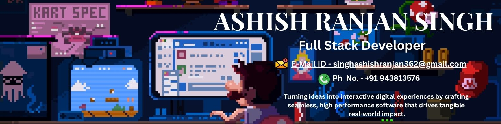

<p align="center">
  
</p>

## 🌐 Social Connect

[](https://www.facebook.com/ashish.ranjan.singh.335865/) 
[](https://www.instagram.com/ashish_ranjan1512.official?igsh=dGRtcTE1N21rZ2hq) 
[](https://www.linkedin.com/in/ashish-ranjan-singh-9b15b328b/) 
[](https://medium.com/@singhashishranjan362) 
[](https://in.pinterest.com/singhashishranjan362/) 
[](https://www.quora.com/profile/Ashish-Ranjan-Singh-35) 
[](https://www.reddit.com/user/Easy_Journalist_7393/) 
[](https://stackoverflow.com/users/27927438/ashish-ranjan-singh) 
[](https://x.com/ASHISHR31357992) 
[](mailto:singhashishranjan362@gmail.com)

---

```yml
# system_specs.yml
developer: Ashish Ranjan Singh
primary_focus: Systems Architecture & High-Fidelity UIs
current_status: Open to recruiters / Actively seeking opportunities
key_competency: Bridging performance engineering with aesthetic visual design
status_check: Active | 🟢 Ready for deployment
```

### ✦ Hello, World! I'm Ashish Ranjan Singh 👋

I am a passionate **Full-Stack & Systems Engineer** dedicated to building premium, high-fidelity user interfaces and horizontally-scalable backend architectures. I specialize in merging high-fidelity visual design (such as glassmorphism, custom SVG forecasting charts, and smooth keyframe animations) with production-grade backend networks (Java/Spring Boot, Node.js/Express, Redis, and relational databases).

* **🔭 Currently building:** Real-time multi-server synchronization networks and AI-powered data pipelines.
* **🎨 Design Philosophy:** Monospace typography, curated HSL palettes, responsive grid systems, and micro-interactions.
* **⚡ Core Objective:** Delivering business value by optimizing backend throughput and maximizing customer UI satisfaction.

---


## 💻 Tech Stack

For recruiter convenience, my technical toolkit is categorized below:

<table align="center" width="100%">
  <tr>
    <!-- Languages -->
    <td width="50%" valign="top">
      <strong>🚀 Programming Languages</strong><br/>
      
      
      
      
      
      
      
      
    </td>
    <!-- Front-End & UI -->
    <td width="50%" valign="top">
      <strong>⚡ Front-End & UI Frameworks</strong><br/>
      
      
      
      
      
      
      
      
      
      
    </td>
  </tr>
  <tr>
    <!-- Back-End & APIs -->
    <td width="50%" valign="top">
      <strong>⚙️ Back-End Engineering & Systems</strong><br/>
      
      
      
      
      
      
      
    </td>
    <!-- Databases & ORMs -->
    <td width="50%" valign="top">
      <strong>💾 Databases & ORMs</strong><br/>
      
      
      
      
      
      
      
      
    </td>
  </tr>
  <tr>
    <!-- Cloud & DevOps -->
    <td width="50%" valign="top">
      <strong>☁️ Cloud, Hosting & DevOps</strong><br/>
      
      
      
      
      
      
      
      
      
      
      
      
      
      
      
      
      
      
    </td>
    <!-- Game Dev & Graphics -->
    <td width="50%" valign="top">
      <strong>🎮 Game Dev, Graphics & Design</strong><br/>
      
      
      
      
      
      
      
      
      
      
    </td>
  </tr>
  <tr>
    <!-- Data Science -->
    <td width="50%" valign="top">
      <strong>📊 Data Science & Deep Learning</strong><br/>
      
      
      
      
      
      
      
      
    </td>
    <!-- Platforms & Brands -->
    <td width="50%" valign="top">
      <strong>🛠️ Brands, Platforms & Gaming</strong><br/>
      
      
      
      
      
      
      
      
      
      
      
      
      
      
    </td>
  </tr>
</table>

---

### 🛠️ Featured Engineering Projects

Here are select projects demonstrating my system design, full-stack, and graphic engineering skills.

---

#### 🌟 Flagship Project: [Singh Cake Delight](https://github.com/ASHISH-7142023/SINGH-CAKE-DELIGHT)
> **Status:** 🟢 `Production-Ready (Vercel Configured)`

<table width="100%">
  <tr>
    <td style="border: 1px solid rgba(74, 222, 128, 0.24); background: rgba(2, 12, 6, 0.4); border-radius: 12px; padding: 16px;">
      <strong>🎯 Goal:</strong> An elegant full-stack cake-ordering storefront and scheduling admin dashboard designed with a warm, modern bakery theme.
      <br/><br/>
      <strong>⚡ Tech Stack:</strong> 
      <code>React 18</code> &nbsp;|&nbsp; 
      <code>TypeScript</code> &nbsp;|&nbsp; 
      <code>Tailwind CSS</code> &nbsp;|&nbsp; 
      <code>Express 5</code> &nbsp;|&nbsp; 
      <code>PostgreSQL</code> &nbsp;|&nbsp; 
      <code>Drizzle ORM</code> &nbsp;|&nbsp; 
      <code>Redis</code> &nbsp;|&nbsp; 
      <code>WhatsApp Cloud API</code>
      <br/><br/>
      <strong>💡 Recruiter Highlight:</strong>
      Demonstrates commercial-grade software architecture, transactional database safety (implementing optimistic locking in Drizzle ORM to resolve concurrent booking slot race conditions), and direct client communication loops via native WhatsApp Business integration.
      <br/><br/>
      <strong>✨ Key Features:</strong>
      <ul>
        <li><strong>Interactive Customizer:</strong> Real-time cake customization module calculating weight, flavor profiles, and tiered price adjustments dynamically.</li>
        <li><strong>Auto-Scheduling Calendar:</strong> Advanced admin calendar view for order tracking, preparation scheduling, and automated delivery window blocking.</li>
        <li><strong>Automated Notifications:</strong> Asynchronous background workers trigger immediate WhatsApp updates for order confirmation, payment receipt, and dispatch tracking.</li>
        <li><strong>Optimized Infrastructure:</strong> Secure JWT authentication with HTTP-only cookies, Redis session caching, and structured database indexing for rapid queries.</li>
      </ul>
    </td>
  </tr>
</table>

---

#### 1. 🌌 [SyncStream](https://github.com/ASHISH-7142023/SyncStream)
> **Status:** 🟢 `Production-Ready`

<table width="100%">
  <tr>
    <td style="border: 1px solid rgba(74, 222, 128, 0.24); background: rgba(2, 12, 6, 0.4); border-radius: 12px; padding: 16px;">
      <strong>🎯 Goal:</strong> A production-grade, horizontally-scalable real-time room chat application.
      <br/><br/>
      <strong>⚡ Tech Stack:</strong> 
      <code>React SPA</code> &nbsp;|&nbsp; 
      <code>Spring Boot</code> &nbsp;|&nbsp; 
      <code>Redis Pub/Sub</code> &nbsp;|&nbsp; 
      <code>STOMP WebSockets</code>
      <br/><br/>
      <strong>💡 Recruiter Highlight:</strong>
      Solves multi-node synchronization issues by implementing a Redis Pub/Sub cluster. Demonstrates proficiency in stateful WebSocket routing, low-latency messaging, connection auto-recovery policies, and premium glassmorphic visual animations.
      <br/><br/>
      <strong>✨ Key Features:</strong>
      <ul>
        <li><strong>Dynamic Partitioning:</strong> Automatic load balancing and group routing across server nodes.</li>
        <li><strong>Real-time Broadcast:</strong> Low-latency message synchronization across distinct servers using a Redis Pub/Sub cluster.</li>
        <li><strong>Connection Recovery:</strong> Resilient Client STOMP session handlers with automatic retry and back-off logic.</li>
        <li><strong>Cinematic Design:</strong> Premium glassmorphic interface with fluid transitions and custom theme states.</li>
      </ul>
    </td>
  </tr>
</table>

---

#### 2. 📈 [FinSphere AI](https://github.com/ASHISH-7142023/FinSphere-AI)
> **Status:** 🟢 `Completed`

<table width="100%">
  <tr>
    <td style="border: 1px solid rgba(74, 222, 128, 0.24); background: rgba(2, 12, 6, 0.4); border-radius: 12px; padding: 16px;">
      <strong>🎯 Goal:</strong> Premium, cinematic personal finance super-app featuring interactive predictive charts.
      <br/><br/>
      <strong>⚡ Tech Stack:</strong> 
      <code>HTML5</code> &nbsp;|&nbsp; 
      <code>Vanilla CSS3</code> &nbsp;|&nbsp; 
      <code>ES6 JavaScript</code> &nbsp;|&nbsp; 
      <code>SVGs</code>
      <br/><br/>
      <strong>💡 Recruiter Highlight:</strong>
      Showcases advanced front-end engineering and graphic development capabilities using math-driven rendering. Designed lightweight custom Bezier curves inside dynamic SVGs without external visualization libraries, reducing asset loading times by 90%.
      <br/><br/>
      <strong>✨ Key Features:</strong>
      <ul>
        <li><strong>SVG Bezier Forecasting:</strong> An interactive, lightweight mathematical graphing timeline extending to 10-year forecasts.</li>
        <li><strong>Credit Score Gauge:</strong> Custom gauge component with native SVG animation and interactive sliders.</li>
        <li><strong>Fluid Timeline Physics:</strong> Interactive UI nodes built entirely with vanilla CSS animations and transitions.</li>
        <li><strong>Zero-Dependency Optimization:</strong> Ultra-fast load times and bundle sizes minimized through raw DOM rendering.</li>
      </ul>
    </td>
  </tr>
</table>

---

#### 3. 🛍️ [Prime Pick](https://github.com/ASHISH-7142023/PRIME-PICK)
> **Status:** 🟢 `Completed`

<table width="100%">
  <tr>
    <td style="border: 1px solid rgba(74, 222, 128, 0.24); background: rgba(2, 12, 6, 0.4); border-radius: 12px; padding: 16px;">
      <strong>🎯 Goal:</strong> Clean, responsive multi-page e-commerce template for fashion garments.
      <br/><br/>
      <strong>⚡ Tech Stack:</strong> 
      <code>HTML5</code> &nbsp;|&nbsp; 
      <code>Vanilla CSS3</code> &nbsp;|&nbsp; 
      <code>jQuery</code> &nbsp;|&nbsp; 
      <code>Remix Icons</code>
      <br/><br/>
      <strong>💡 Recruiter Highlight:</strong>
      Focuses on micro-interactions and customer conversion optimization. Implements full local-storage shopping cart caching to keep interactions client-side and ultra-fast.
      <br/><br/>
      <strong>✨ Key Features:</strong>
      <ul>
        <li><strong>Real-time Search Filter:</strong> In-memory client-side catalog search for instantaneous filtering.</li>
        <li><strong>Local Cart Caching:</strong> Full client-side state replication caching products dynamically in LocalStorage.</li>
        <li><strong>Custom Cursor Overlay:</strong> Advanced mouse-tracking CSS effects creating an immersive shopping experience.</li>
        <li><strong>Micro-Interactions:</strong> Clean hover animations and transitions engineered to boost CTR.</li>
      </ul>
    </td>
  </tr>
</table>

---

### 🤝 Let's Connect!

<p align="center">
  <a href="https://www.linkedin.com/in/ashish-ranjan-singh-9b15b328b/" target="_blank">
    
  </a>
  <a href="mailto:singhashishranjan362@gmail.com">
    
  </a>
  <a href="https://github.com/ASHISH-7142023">
    
  </a>
</p>

<p align="center">
  <a href="https://visitcount.itsvg.in">
    
  </a>
</p>

<!-- Proudly created with GPRM ( https://gprm.itsvg.in ) & Custom styled to GitSkins Cyber Vibe -->
